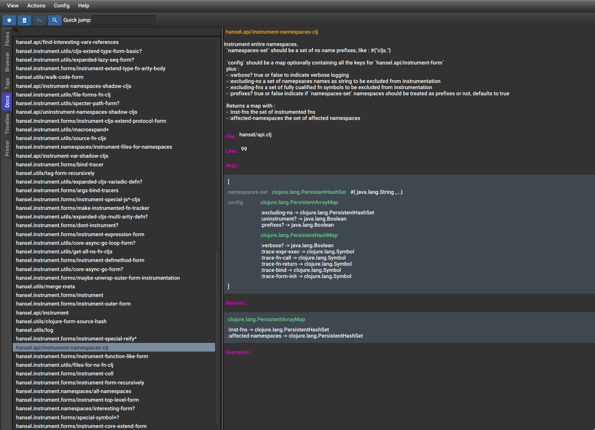

# Dyna-Spec

**Experimental and still a WIP, somehow usable but with almost no documentation**

Dyna-Spec generates library functions documentation by instrumenting a code base, running its tests and sampling function
calls and return values.

Add an alias to the project you want to generate docs for like :

```clojure
{:aliases

 ;; Assuming this is your test configuration
 :test {:extra-paths ["test"]
       :extra-deps {io.github.cognitect-labs/test-runner {:git/tag "v0.5.1" :git/sha "dfb30dd"}}
       :main-opts   ["-m" "cognitect.test-runner"]
       :exec-fn cognitect.test-runner.api/test}
       
 ;; Add your dyna-spec alias
 {:dyna-spec
  {:classpath-overrides {org.clojure/clojure nil}
   :extra-deps {com.github.flow-storm/clojure {:mvn/version "1.11.2-4"}
                com.github.flow-storm/dyna-spec {:git/sha "4dc9a01ff2f15e9329c0cdad4d907570d852a27f"}}
   :exec-fn dyna-spec.main/run
   :exec-args {:jar-name "my-project-dyna-spec" ;; this will generate my-project-dyna-spec.jar
               :test-fn cognitect.test-runner.api/test ;; whatever function runs your tests
               :test-fn-args [{}]} ;; arguments if needed
   :jvm-opts ["-Dclojure.storm.instrumentOnlyPrefixes=hansel"
              "-Dclojure.storm.instrumentSkipRegex=.*test.*"]}}}
```

And then run : 

```
clj -X:test:dyna-spec
```

which will generate `my-project-dyna-spec.jar`.

The only application currently able to show this docs is https://github.com/flow-storm/flow-storm-debugger

Add as many dyna-spec jars as you want to your classpath using `:deps :local/root` and then you will be able to 
explore them in FlowStorm Docs tool like this :



